# 구현사항

## 회원가입

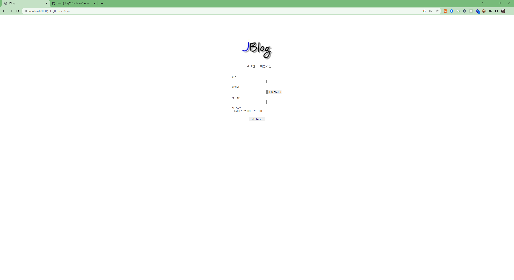

### id 중복시 ajax로 alert 발생

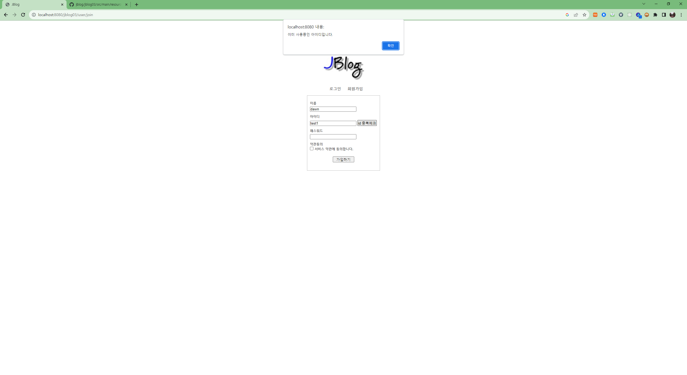

### 중복 아닐시 체크 표시

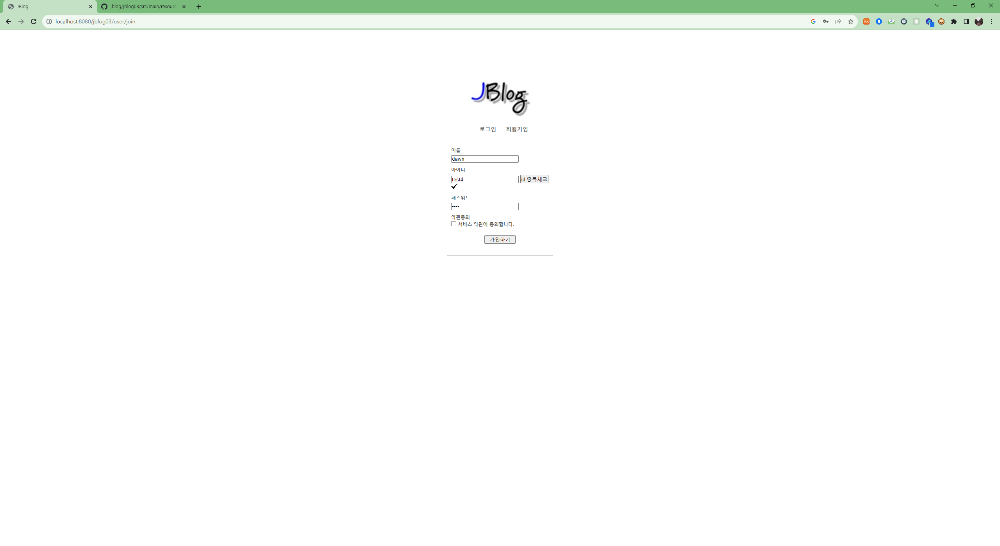

## 로그인

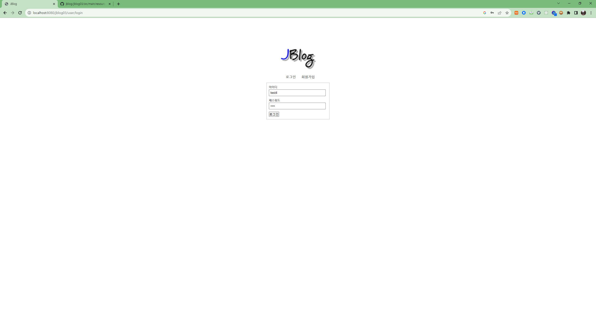

### 최초 블로그

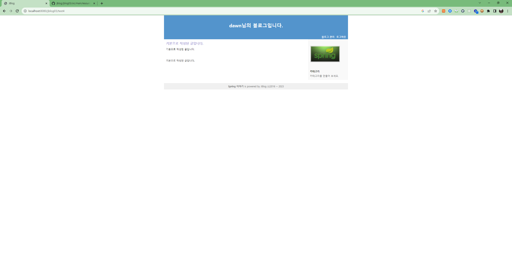

- 1개의 글과 카테고리를 만들어서 제공합니다.

# 블로그 관리

### 이름 수정 전

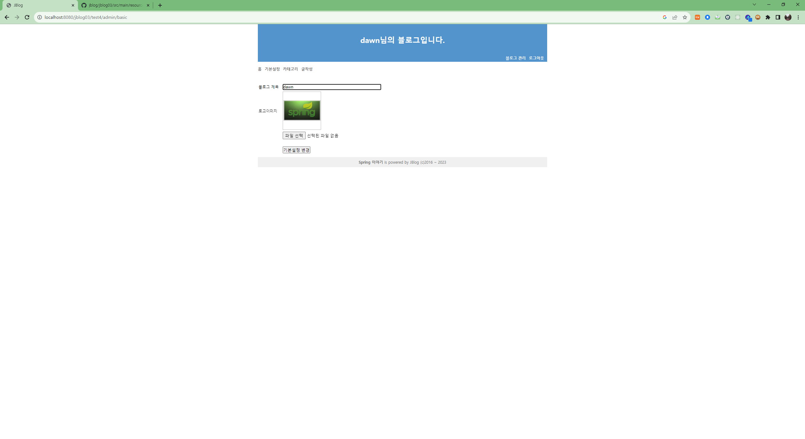

### 이름 수정 전

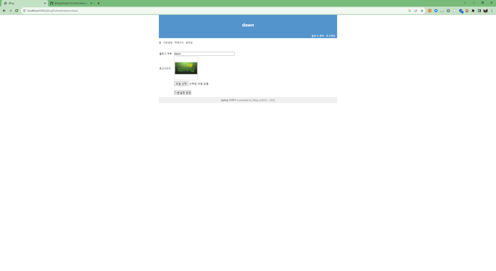

### 사진 변경

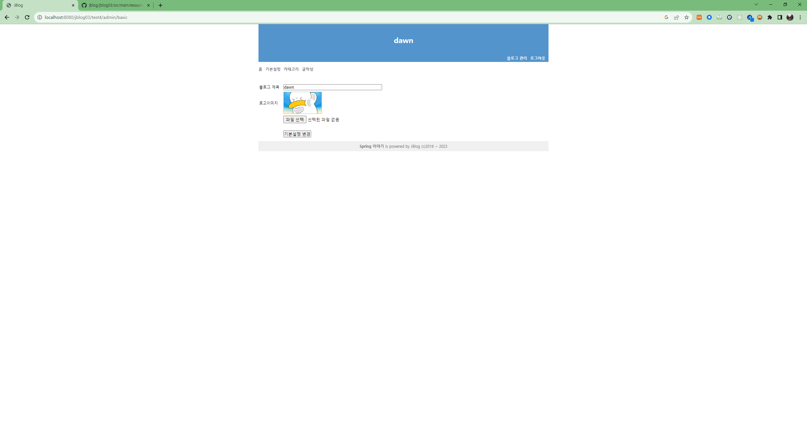

### 카테고리 기본

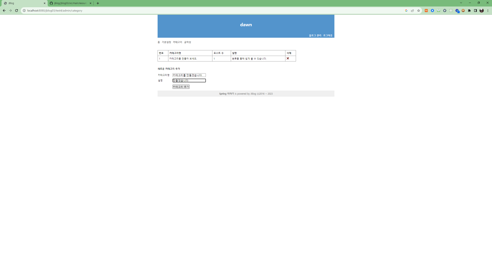

### 카테고리 추가

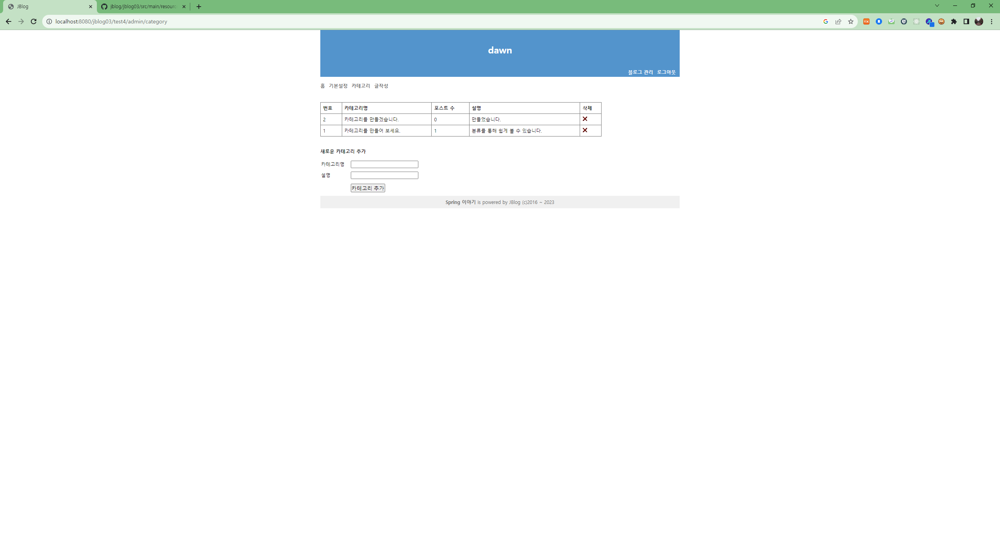

### 글 추가

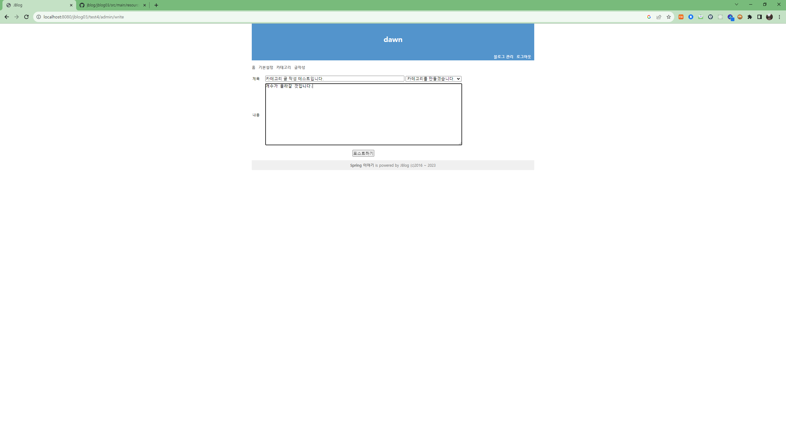
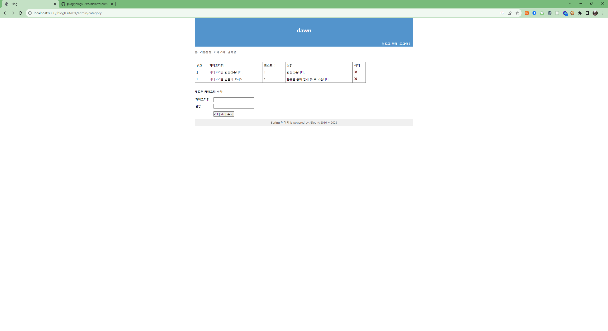

### 다른 유저 admin 접근 시 401페이지

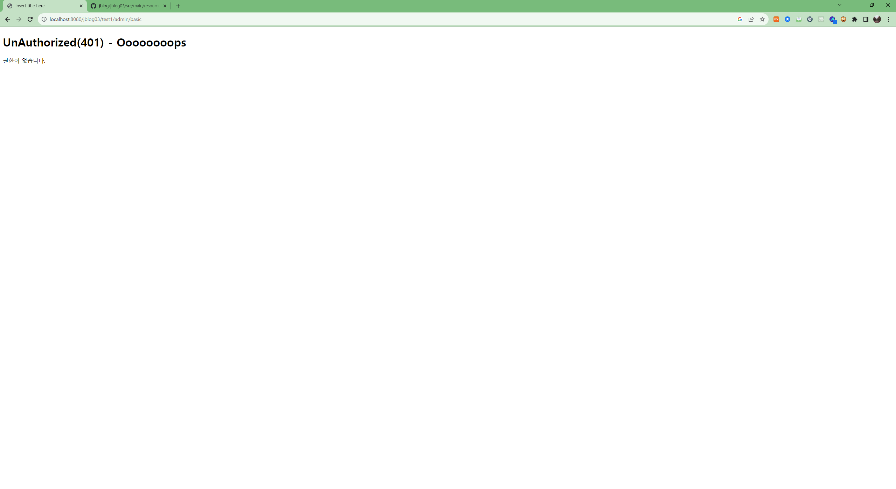

### 없는 글 접근 시 404 페이지

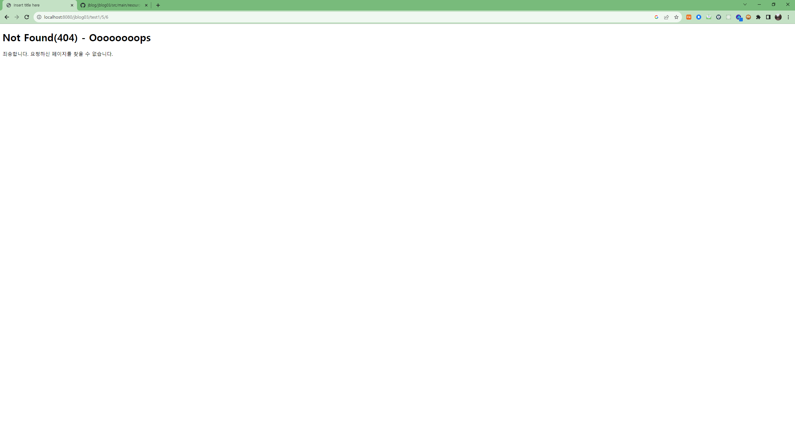
